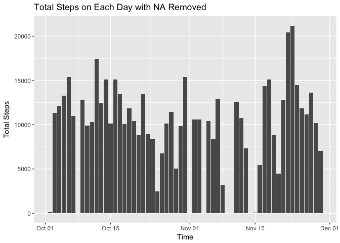
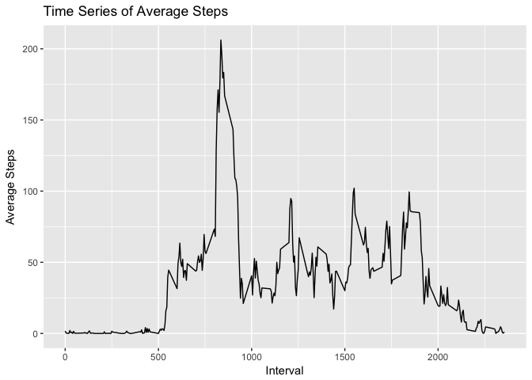
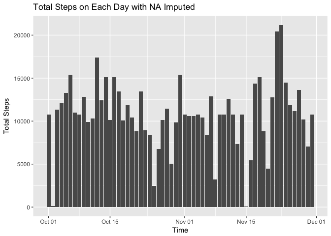
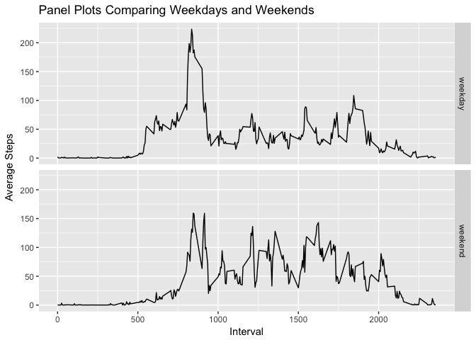

# Activity Analysis Report
Ri Feng  
11/14/2017  


### Introduction
This file is the analysis report of [Coursera courses project](https://www.coursera.org/learn/reproducible-research/peer/gYyPt/course-project-1) of John Hopkins Data Science which aims to research an individual daily walking steps. 

### Data exploration

```r
temp = tempfile()
download.file("https://d396qusza40orc.cloudfront.net/repdata%2Fdata%2Factivity.zip",temp)
rdat = read.csv(unz(temp,"activity.csv"))
unlink(temp)
```

```r
str(rdat)
```

```
## 'data.frame':	17568 obs. of  3 variables:
##  $ steps   : int  NA NA NA NA NA NA NA NA NA NA ...
##  $ date    : Factor w/ 61 levels "2012-10-01","2012-10-02",..: 1 1 1 1 1 1 1 1 1 1 ...
##  $ interval: int  0 5 10 15 20 25 30 35 40 45 ...
```
From the simply exploration, the dataset has 3 variables:  steps, date, interval with 17568 observations.

### Histogram of total steps each day
Since no more information about the missing value, right now, the total steps are calculated with all these missing values removed.

```r
dat.cplt = rdat[complete.cases(rdat),]
TotalSteps = with(dat.cplt, aggregate(steps, by = list(date),sum))
names(TotalSteps) = c("Time", "tSteps")

ggplot(TotalSteps, aes(x = as.Date(Time), y = tSteps)) + geom_col() + labs(x = "Time", y = "Total Steps", title = "Total Steps on Each Day with NA Removed")
```

<!-- -->

### Mean and Median steps each day

```r
sMean = with(TotalSteps, mean(tSteps))
sMedian = with(TotalSteps, median(tSteps))
```
After calculating the total steps of each day, it's easy to find the mean value is 1.0766\times 10^{4} and the median is 10765. The two statistics are quite close.

### Time series of average steps

```r
AvgItv = with(dat.cplt, aggregate(steps, by = list(interval), mean))
names(AvgItv) = c("Interval", "AvgSteps")

ggplot(AvgItv, aes(x = Interval, y = AvgSteps)) + geom_line(linetype = "solid") + labs(y = "Average Steps", title = "Time Series of Average Steps")
```

<!-- -->

From the plot, it can be inferred that the individual should be quite before Interval 500 or after 2200, since its average steps are pretty low. The active period is from Interval 550 to 1800, and it reaches the peak at around Interval 800.

### Interval with max steps
The Interval with average max steps is 835. This result is reasonable since it's consilient with the plot above.

### Strategy for imputing missing data
It's assumed that the individual activities in each day are steady. Hence, it's reasonable to impute missing values according to the Average Interval Steps.  
From the Time Series Plot, it can be found that in different time period, the average steps change dramatically. So it's not a good idea to use a simple value to replace all missing values. It's better to refer the average steps at specific interval.   
My strategy is to split total interval into 5 pieces according to the Time Series Plot, which are [0,500), [500,780), [780,880), [880,2200),[2200,2355]. In each piece, the missing values are replaced by the average steps of the "piece period". 

```r
# Code for strategy
p1 = mean(AvgItv[AvgItv$Interval<500,"AvgSteps"])
p2 = mean(AvgItv[AvgItv$Interval>=500 & AvgItv$Interval<780,"AvgSteps"])
p3 = mean(AvgItv[AvgItv$Interval>=780 & AvgItv$Interval<880,"AvgSteps"])
p4 = mean(AvgItv[AvgItv$Interval>=880 & AvgItv$Interval<2200,"AvgSteps"])
p5 = mean(AvgItv[2200<=AvgItv$Interval,"AvgSteps"])
cdat = rdat
cdat[is.na(cdat$steps) & cdat$interval<500, "steps"] = p1
cdat[is.na(cdat$steps) & 500<=cdat$interval & cdat$interval<780, "steps"] = p2
cdat[is.na(cdat$steps) & (780<=cdat$interval & cdat$interval<880), "steps"] = p3
cdat[is.na(cdat$steps) & (880<=cdat$interval & cdat$interval<2200), "steps"] = p4
cdat[is.na(cdat$steps) & 2200<=cdat$interval, "steps"] = p5
```

### Histogram of total steps each day (with missing value imputed)

```r
cTotalSteps = with(cdat, aggregate(steps, by = list(date), sum))
names(cTotalSteps) = c("Time", "tSteps")

ggplot(cTotalSteps, aes(x = as.Date(Time), y = tSteps)) + geom_col() + labs(x = "Time", y = "Total Steps", title = "Total Steps on Each Day with NA Imputed")
```

<!-- -->

### Panel plots comparing weekdays and weekends

```r
# label date
cdat$weekday = wday(cdat$date, label = F)
cdat[cdat$weekday %in% c(2:6),"weekday"] = "weekday"
cdat[cdat$weekday %in% c(1,7),"weekday"] = "weekend"

# prepare dataset
wdat = with(cdat, aggregate(steps, by = list(interval, weekday), mean))
names(wdat) = c("interval", "weekday", "steps")

# draw plots
ggplot(wdat, aes(x = interval, y = steps)) + geom_line() + facet_grid(weekday ~.) + labs(x = "Interval", y = "Average Steps", title = "Panel Plots Comparing Weekdays and Weekends")
```

<!-- -->
